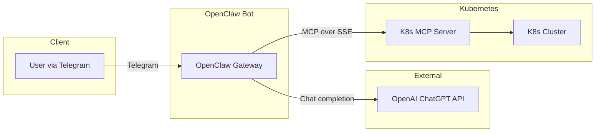

# OpenClaw K8s Operations Bot

Automate Kubernetes cluster operations through Telegram using OpenClaw as the AI gateway and ChatGPT as the reasoning engine.

## Architecture



**Components:**

| Service | Role | Image |
|---------|------|-------|
| OpenClaw + mcporter | AI gateway, Telegram integration, tool orchestration, MCP client | `ghcr.io/openclaw/openclaw:latest` + mcporter |
| Kubernetes MCP Server | K8s API bridge via Model Context Protocol | `ghcr.io/containers/kubernetes-mcp-server:latest` |
| OpenAI ChatGPT | AI reasoning and tool selection | External API |

**How MCP integration works:**

OpenClaw does not have a built-in MCP client. This project uses [mcporter](https://www.npmjs.com/package/mcporter) (the officially recommended MCP server manager) as the bridge:

1. **mcporter** is pre-installed in the OpenClaw container via `Dockerfile.openclaw`
2. **`config/mcporter.json`** configures the connection to the K8s MCP server (SSE transport)
3. **`skills/kubernetes-ops/SKILL.md`** teaches the AI agent how to use `mcporter` CLI to call K8s tools
4. The AI uses OpenClaw's `exec` tool to run `mcporter tool call kubernetes <tool> '<args>'`

## Prerequisites

- Docker and Docker Compose v2+
- An OpenAI API key (from [platform.openai.com](https://platform.openai.com/api-keys))
- A Telegram bot token (from [@BotFather](https://t.me/BotFather))
- Your Telegram user ID (from [@userinfobot](https://t.me/userinfobot))
- A valid `kubeconfig` file with access to your Kubernetes cluster

## Quick Start

### 1. Clone and configure

```bash
git clone <repo-url> openclaw-bot
cd openclaw-bot

# Create your environment file from the template
cp .env.example .env
```

Edit `.env` with your actual values:

```bash
OPENAI_API_KEY=sk-your-actual-key
TELEGRAM_BOT_TOKEN=your-bot-token-from-botfather
TELEGRAM_ALLOWED_USERS=your-telegram-user-id
```

### 2. Add your kubeconfig

Copy your Kubernetes config into the project:

```bash
# Option A: Copy from default location
cp ~/.kube/config kubeconfig/config

# Option B: Export from a specific context
kubectl config view --minify --flatten > kubeconfig/config
```

### 3. Configure Telegram bot settings

The default `config/openclaw.json` uses `${VAR}` environment variable interpolation, so values from `.env` are applied automatically. No manual edits needed unless you want to customize further.

### 4. Build and start the services

```bash
# Build the custom OpenClaw image (installs mcporter)
docker compose build

# Start all services
docker compose up -d
```

### 5. Verify

```bash
# Check both services are running
docker compose ps

# Check OpenClaw logs
docker compose logs -f openclaw-gateway

# Check K8s MCP Server logs
docker compose logs -f kubernetes-mcp-server

# Check gateway health
curl -fsS http://127.0.0.1:18789/healthz
```

### 6. Access the Web UI

After startup, the console prints the access URL with token:

```
==========================================
  OpenClaw Gateway - Access URLs
==========================================
  UI:  http://localhost:18789/?token=<your-token>
  API: http://localhost:18789
==========================================
```

Open the URL in your browser. On first access, you need to **approve the device**:

```bash
# 1. Open the UI URL in browser and click "Connect"

# 2. List pending devices
docker exec -it openclaw-gateway node dist/index.js devices list

# 3. Approve the pending request (copy the Request ID from the table)
docker exec -it openclaw-gateway node dist/index.js devices approve <request-id>
```

**Important:** The request ID expires quickly. Open the browser first, click Connect, then immediately run the `devices list` and `approve` commands.

Once approved, the dashboard shows "Health: OK" and you can use the Chat tab.

### 7. Chat with your bot

Open Telegram and message your bot. Try commands like:

- "List all namespaces in the cluster"
- "Show pods in the production namespace"
- "Get events with warnings"
- "Show resource usage for all nodes"
- "Describe the deployment named nginx in default namespace"
- "Show logs for pod my-app-xyz in staging namespace"

## Configuration Reference

### Environment Variables (`.env`)

| Variable | Description | Required |
|----------|-------------|----------|
| `OPENAI_API_KEY` | OpenAI API key for ChatGPT | Yes |
| `TELEGRAM_BOT_TOKEN` | Telegram bot token from @BotFather | Yes |
| `TELEGRAM_ALLOWED_USERS` | Comma-separated Telegram user IDs | Yes |

### OpenClaw Config (`config/openclaw.json`)

Key sections:

- **identity** - Bot name and personality theme
- **agents.defaults.model** - AI model selection (default: `openai/gpt-4o`)
- **channels.telegram** - Telegram bot settings and access control
- **gateway** - Gateway port and UI settings

### mcporter Config (`config/mcporter.json`)

Defines the connection to the Kubernetes MCP Server:

```json
{
  "mcpServers": {
    "kubernetes": {
      "url": "http://kubernetes-mcp-server:8089/sse",
      "transport": "sse"
    }
  }
}
```

The URL uses the Docker Compose service name `kubernetes-mcp-server` which resolves via Docker's internal DNS.

### Custom Skill (`skills/kubernetes-ops/SKILL.md`)

Teaches the AI agent how to use `mcporter` CLI to call Kubernetes tools. The agent uses OpenClaw's built-in `exec` tool to run commands like:

```bash
mcporter tool call kubernetes pods_list_in_namespace '{"namespace":"production"}'
```

Edit the SKILL.md to add or customize the instructions the AI follows.

### Kubernetes MCP Server

The MCP server runs in **read-only** and **stateless** mode by default for safety and container compatibility. To enable write operations, remove `--read-only` from the command in `docker-compose.yml`:

```yaml
kubernetes-mcp-server:
  command:
    - "--port"
    - "8089"
    # - "--read-only"
    - "--stateless"
    - "--log-level"
    - "2"
```

To enable Helm operations, add the `--toolsets` flag:

```yaml
kubernetes-mcp-server:
  command:
    - "--port"
    - "8089"
    - "--read-only"
    - "--stateless"
    - "--toolsets"
    - "core,config,helm"
    - "--log-level"
    - "2"
```

## Available K8s Operations

With `containers/kubernetes-mcp-server`, these tools are available to the AI:

| Category | Tools | Description |
|----------|-------|-------------|
| Pods | `pods_list`, `pods_get`, `pods_log`, `pods_exec`, `pods_top` | List, inspect, get logs, exec, and check resource usage |
| Resources | `resources_list`, `resources_get`, `resources_create_or_update`, `resources_delete` | CRUD on any K8s resource |
| Events | `events_list` | View cluster events for debugging |
| Namespaces | `namespaces_list` | List all namespaces |
| Nodes | `nodes_top`, `nodes_log` | Node resource metrics and logs |
| Config | `configuration_view`, `configuration_contexts_list` | View kubeconfig and contexts |
| Helm | `helm_install`, `helm_list`, `helm_uninstall` | Manage Helm releases (requires `helm` toolset) |

## Operations

### View logs

```bash
docker compose logs -f                         # All services
docker compose logs -f openclaw-gateway        # OpenClaw only
docker compose logs -f kubernetes-mcp-server   # K8s MCP only
```

### Restart services

```bash
docker compose restart                         # All
docker compose restart openclaw-gateway        # OpenClaw only
```

### Stop

```bash
docker compose down                       # Stop and remove containers
docker compose down -v                    # Also remove volumes (loses state)
```

### Update images

```bash
docker compose pull
docker compose build
docker compose up -d
```

## Security Considerations

- **kubeconfig**: Mounted read-only into the MCP server container. Never committed to git.
- **API keys**: Stored in `.env` which is git-ignored. Never hardcode in config files.
- **Read-only mode**: K8s MCP server defaults to read-only, preventing accidental cluster changes.
- **Network isolation**: K8s MCP server is only accessible via Docker internal network (`expose`, not `ports`).
- **Gateway binding**: Gateway binds to `lan` mode and the Docker port is published to `127.0.0.1` only (not `0.0.0.0`).
- **Telegram access control**: Only whitelisted user IDs can interact with the bot.
- **No new privileges**: Both containers run with `no-new-privileges` security option.
- **Resource limits**: CPU and memory limits are set to prevent resource exhaustion.
- **Health checks**: Built-in Docker healthcheck monitors gateway availability via `/healthz`.

## Troubleshooting

### OpenClaw not starting

```bash
docker compose logs openclaw-gateway
```

Common issues:
- Missing or invalid `OPENAI_API_KEY`
- Invalid `openclaw.json` syntax -- OpenClaw uses strict schema validation; unknown keys cause startup failure. Run `openclaw doctor --fix` inside the container to diagnose.
- Port 18789 already in use

### K8s MCP Server connection issues

```bash
docker compose logs kubernetes-mcp-server
```

Common issues:
- Invalid or missing kubeconfig at `kubeconfig/config`
- Kubeconfig references `localhost` or `127.0.0.1` which won't work from inside Docker (use the actual cluster API server address)
- Cluster API server not reachable from Docker network

### Web UI shows "pairing required" or "Offline"

The OpenClaw dashboard requires device approval for each new browser:

```bash
# Open the UI and click Connect first, then quickly run:
docker exec -it openclaw-gateway node dist/index.js devices list
docker exec -it openclaw-gateway node dist/index.js devices approve <request-id>
```

If you get `Error: unknown requestId`, the request expired. Refresh the browser, click Connect again, and repeat the approve process.

### Bot not responding on Telegram

- Verify the bot token is correct
- Check that your Telegram user ID is in the `allowFrom` list
- Ensure OpenClaw gateway is healthy: `docker compose ps`

## References

### OpenClaw - Personal AI Assistant

- Website: [https://openclaw.ai](https://openclaw.ai/)
- GitHub: [https://github.com/openclaw/openclaw](https://github.com/openclaw/openclaw)
- Documentation: [https://docs.openclaw.ai](https://docs.openclaw.ai)

Open-source personal AI assistant that runs on your machine. Supports WhatsApp, Telegram, Discord, Slack, Signal, iMessage. Works with Anthropic, OpenAI, Google, local models. Extensible via skills and MCP servers.

### Kubernetes MCP Server (containers/kubernetes-mcp-server)

- GitHub: [https://github.com/containers/kubernetes-mcp-server](https://github.com/containers/kubernetes-mcp-server)
- Docker image: `ghcr.io/containers/kubernetes-mcp-server:latest`
- License: Apache-2.0

Go-based native MCP server for Kubernetes and OpenShift. Interacts directly with the K8s API server without requiring kubectl or any external dependencies. Supports multi-cluster, read-only mode, Helm, and SSE/HTTP transport. **This is the MCP server used in this project.**

### Kubernetes MCP Server (Flux159/mcp-server-kubernetes)

- GitHub: [https://github.com/Flux159/mcp-server-kubernetes](https://github.com/Flux159/mcp-server-kubernetes)
- npm: [mcp-server-kubernetes](https://www.npmjs.com/package/mcp-server-kubernetes)
- License: MIT

Node.js/TypeScript-based MCP server wrapping kubectl and helm CLI. Provides unified kubectl API, Helm operations, pod cleanup, node management, and troubleshooting prompts. Alternative option if you prefer a kubectl-based approach.

### Model Context Protocol (MCP)

- Specification: [https://modelcontextprotocol.io](https://modelcontextprotocol.io)
